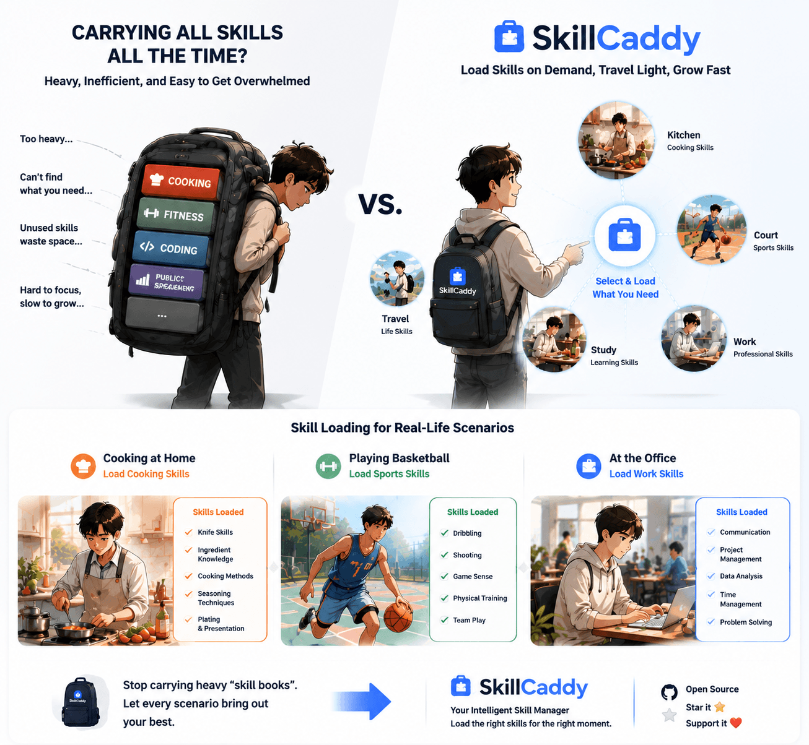

# Skillcaddy

[English](README.md) · [中文](README_CN.md)

Local AI skills central library + per-project symlink enablement. One AISkills directory holds every skill source; symlink what you need into any project on demand.



## Why Skillcaddy?

If you use Claude Code, Codex, OpenCode, or Pi across multiple projects, you eventually hit one of these:

- The same skill lives in three repos, slightly drifted each time
- A new project means copying skills over and wondering which version is current
- An upstream skill gets updated but your local copy is weeks behind
- A Claude-Code-only entry needs to coexist with the agents-side list
- An archived skill slips back in because no one gated it

Skillcaddy fixes this with one AISkills directory as the source of truth and per-project symlinks as the delivery mechanism.

- **One source of truth** — `~/AISkills/` aggregates `official / github / personal / archived / skills`
- **Zero project pollution** — enable by symlink into `.agents/skills/`; never copy
- **Multi-Agent by default** — one symlink reaches Claude Code, Codex, OpenCode, Pi via their standard paths
- **Independent enable / disable** — agents-side and Claude-Code-side are tracked separately
- **Safe by default** — disable only removes the symlink; `archived/` requires explicit naming
- **Contribute-friendly** — new skills land under `skills/<name>/` with `SKILL.md` + `agents/openai.yaml` and ship with the repo

Whether you're a solo dev with half a dozen repos, a small team standardizing on shared skills, or an author publishing reusable ones — the contract is the same: skills belong to your library, not to any one project.

## Installation

```bash
git clone https://github.com/chenweil/skillcaddy.git
cd skillcaddy
npm start
```

Requires Node.js >= 20. The web manager uses the fixed default URL `http://127.0.0.1:4173`. Fill in the target project path on the page, and enable/disable skills. If that port is temporarily occupied, start with `PORT=<other-port> npm start`.

To make the bundled `skillcaddy-manager` skill available to AI agents from any project, install its global entry once:

```bash
npm run install:manager
npm run check:manager
```

This creates a managed symlink at `~/.agents/skills/skillcaddy-manager` pointing back to `skills/skillcaddy-manager`. It will not overwrite an existing file, directory, or symlink that points somewhere else.

You can also pass the project path through the URL:

```text
http://127.0.0.1:4173/?projectPath=<encoded-project-path>
```

The page loads that project immediately, keeps recently used project paths in browser-local history, and lets you bulk-enable all available skills from a library with the library-level `+` button. If a library was enabled by mistake, use the library-level `×` button to clean that library from both Agents and Claude Code.

## Skill metadata

`SKILL.md` remains the Agent-facing contract. Human-facing notes and categorization are stored by Skillcaddy under `.skillcaddy/metadata/.../skillcaddy.json` so external source repositories stay clean:

```json
{
  "note": "Useful before and after code changes to keep execution disciplined.",
  "tags": ["Developer Tools", "Quality", "Workflow"],
  "autoEnable": true
}
```

The web UI reads legacy `<skill-dir>/skillcaddy.json` files for compatibility, but new edits are written to the local sidecar metadata store. Tags appear as filter tabs and badge pills; notes are shown on each skill card. Set `autoEnable` to `false` to exclude a deprecated or risky skill from library-level bulk enable while still allowing single-skill manual enable. This keeps upstream source repositories clean while still making a large local library easier to browse.

## Platform compatibility

| Platform | Status | Notes |
|----------|--------|-------|
| macOS | ✅ Fully supported | Native directory symlinks |
| Linux | ✅ Fully supported | Native directory symlinks |
| Windows | ⚠️ Extra setup required | See below |

### Windows prerequisites

Skillcaddy creates directory symlinks via Node's `fs.symlink(..., 'dir')`. On Windows this call requires one of the following or it throws `EPERM`:

1. **Enable Developer Mode (recommended)**
   - Settings → Privacy & Security → For developers → **Developer Mode**
   - Applies to Windows 10 Creators Update (1703) and above
2. **Run as Administrator**
   - Run `npm start` in an elevated terminal

### Known Windows limitations

- `readlink` may return the target with a `\\?\` prefix or backslashes, which can affect the duplicate-alias-target detection (`existingTarget !== resolvedSkillPath` check in `enableSkill`).
- NTFS is case-insensitive by default, but the code compares aliases case-sensitively. Usually fine in practice, but aliases that differ only in case are treated as two different skills.
- No Windows-specific path normalization, junction fallback, or copy-downgrade.

### Planned compatibility improvements (not implemented)

To make Skillcaddy work out of the box on Windows, the following strategies will be introduced later — but **none are implemented in the current version**:

- **Platform branch**: when `process.platform === 'win32'` is detected, prefer junction (`fs.symlink(target, path, 'junction')`); junctions don't require Developer Mode.
- **Failure fallback**: catch `EPERM` and recursively copy skill contents into `.agents/skills/`, and modify `disableSkill` to remove the real directory.
- **Path normalization**: `resolveLinkTarget` strips the `\\?\` prefix, normalizes separators, and compares case-insensitively on Windows.
- **README Windows section**: add PowerShell commands, disk-format requirements (NTFS), and a junction-vs-symlink trade-off note.

## Architecture

```
┌─────────────────────────────────────────────────────────────────┐
│                     Skillcaddy (central library)                 │
│  ~/AISkills/                                                    │
│  ├── official/      ─┬─ my-skill/SKILL.md                       │
│  ├── github/        ─┤                                          │
│  ├── personal/      ─┴─ another-skill/SKILL.md                  │
│  ├── archived/                                                   │
│  └── skills/         ← bundled with the repo (source: local)    │
└─────────────────────────────────────────────────────────────────┘
                              │
              Symlinks created on enable
                              ▼
┌─────────────────────────────────────────────────────────────────┐
│                         Project directory                        │
│  ~/projects/my-app/                                             │
│  ├── .agents/skills/                                            │
│  │   ├── my-skill ──────────────► ~/AISkills/official/my-skill  │
│  │   └── another-skill ─────────► ~/AISkills/personal/...       │
│  └── .claude/skills/                                            │
│  │   ├── my-skill ──► ../../.agents/skills/my-skill             │
│  │   └── another-skill ─► ../../.agents/skills/another-skill    │
│  └── .opencode/skills/  (optional)                              │
└─────────────────────────────────────────────────────────────────┘
                              │
      Each Agent auto-discovers and loads skills directories
                              ▼
┌─────────────────────────────────────────────────────────────────┐
│  Agent          │ Project-level skills path   │ User-level path │
│─────────────────────────────────────────────────────────────────│
│  Claude Code    │ .claude/skills/             │ ~/.claude/skills │
│  OpenCode       │ .opencode/skills/           │ ~/.config/...    │
│                 │ .claude/skills/             │ ~/.claude/skills │
│                 │ .agents/skills/             │ ~/.agents/skills │
│  Codex          │ .agents/skills/             │ ~/.agents/skills │
│  Pi             │ .pi/skills/                 │ ~/.pi/agent/...  │
│                 │ .agents/skills/             │ ~/.agents/skills │
└─────────────────────────────────────────────────────────────────┘
```

**Core design**:
- `.agents/skills` is the cross-Agent standard path; every Agent recognizes it.
- `.claude/skills` is Claude-Code-specific, but uses secondary symlinks pointing back into `.agents/skills`.
- Enable once, share across multiple Agents; disable only removes the symlink, source files stay safe.

## Directory layout

```text
skillcaddy/
├── official/      # Official / upstream skills (gitignored, fill locally)
├── github/        # Skills cloned from GitHub (gitignored)
├── personal/      # Personal original skills (gitignored)
├── archived/      # Retired skills (gitignored)
├── skills/        # Repo-bundled skills (shipped with this project; currently hosts skillcaddy-manager)
├── lib/           # Manager code
├── public/        # Web UI
├── scripts/       # Maintenance scripts (e.g. pull-github.sh)
├── server.js
└── test/
```

The four external skill source directories (`official / github / personal / archived`) are added to `.gitignore`; after clone they're empty shells — fill them as described in [Adding a skill](#adding-a-skill) below. `skills/` is the repo-bundled source, shipped with this project, and is **not** in `.gitignore`.

Each skill is a subdirectory. A `SKILL.md` is recommended (describes when and how to use it):

```text
official/
└── my-skill/
    └── SKILL.md
```

## Adding a skill

Drop in directly (simplest):

```bash
mkdir -p official/my-skill
# write the files into official/my-skill/
```

Clone from GitHub:

```bash
git clone https://github.com/some/repo.git github/some-skill
```

Bundled with this repo (only when contributing to Skillcaddy itself):

```text
skills/<skill-name>/
├── SKILL.md
└── agents/
    └── openai.yaml   # Codex / OpenCode metadata (optional)
```

Skills under `skills/` are tagged during scan as `source: 'local'`, `id: 'local/<name>'` — behavior is identical to other sources and they can be enabled into any project's `.agents/skills/`.

On startup the manager scans every source directory (`official / github / personal / archived / skills`); no service restart is needed to see new skills in the UI.

## Updating GitHub sources

Bulk fast-forward pull every `github/` sub-repo. Dirty working trees are automatically skipped, so local edits won't be clobbered:

```bash
npm run pull:github
```

## Skills bundled with this project

### skillcaddy-manager

Lets an Agent (especially Codex) know how to use Skillcaddy itself correctly:

- List currently available skills (source / collection / alias / path)
- Enable / disable a single skill, or batch-operate on a whole source / collection
- Sync Claude Code entry points
- Update GitHub-source local clones
- Health check (broken links, alias conflicts, archived mis-enabled)
- Detect conflicts and require user confirmation

**Safety rules**: only operate on project-side `.agents/skills` symlinks; never delete central source files; never touch `archived/` unless explicitly named; always produce a dry-run summary before any state change.

**Invocation**: `agents/openai.yaml` sets `allow_implicit_invocation: true`, so the Agent auto-loads it when seeing a relevant request.

## Enable / Disable

**Enable**: creates a symlink under the project's `.agents/skills/` pointing back into the central library.

```text
<project>/.agents/skills/<alias> -> <skillcaddy>/<source>/<skill>
```

**Sync Claude**: creates a `.claude/skills/` entry point for Claude Code, where each skill symlinks into `.agents/skills/`.

```text
<project>/.claude/skills/<alias> -> ../../.agents/skills/<alias>
```

**Disable**: removes the symlink. The source file is left untouched.

**Why two layers of symlinks?**
- `.agents/skills` is the Agent Skills standard; Codex / OpenCode / Pi all recognize it.
- `.claude/skills` lets Claude Code use them too, with independent enable/disable.
- Enable once, share across Agents; disable doesn't touch the source files — safe and reversible.

## Recommendation System

Skillcaddy includes a built-in recommendation system to help users discover and choose appropriate skills.

### Quick View

```bash
node skills/skillcaddy-manager/scripts/view-recommendations.cjs onboarding
node skills/skillcaddy-manager/scripts/view-recommendations.cjs scenario new-project
```

### Recommendation Principles

- **Analyze first**: Inspect the current library and project context before recommending
- **Platform first**: Empty libraries should start with discovery platforms, not a fixed starter library
- **Scenario split**: mattpocock + lencx is for clear development workflows, not the blank default
- **Conflict detection**: Auto-detect overlapping libraries (e.g., mattpocock vs superpowers)
- **Global detection**: Detect global skills directories and suggest unified management

### Empty-Library Default

When the library is empty, the default recommendation is:

1. Discovery platforms: `skillsmp`, `skills.sh`
2. Then classify the use case: development, writing, research, design
3. Only after that, choose a starter library

### Development Starter

**Development workflow golden combo:**

1. **mattpocock/skills** (workflow suite)
   - Setup: `setup-matt-pocock-skills` one-click configuration
   - Includes: TDD, domain modeling, debugging, implementation, grilling

2. **lencx/skills** (project control)
   - coding-protocol: Prevent AI from making unintended changes
   - keel: Architecture governance

### Utility Scripts

```bash
node skills/skillcaddy-manager/scripts/check-conflicts.cjs superpowers
node skills/skillcaddy-manager/scripts/check-global-skills.cjs
node skills/skillcaddy-manager/scripts/version-manager.cjs check
```

See [references/RECOMMENDATION_GUIDE.md](references/RECOMMENDATION_GUIDE.md) for detailed documentation.


## Tests

```bash
npm test
```

## Link
[Linux Do](https://linux.do/)
[浅谈 AI 编程](https://mp.weixin.qq.com/s/f-NIkyxIuA8vjAUDp1bh5w)
[深度思考：架构腐朽 & Loop Engineering](https://mp.weixin.qq.com/s/wINKSDQCroWBvf29h567zA)
