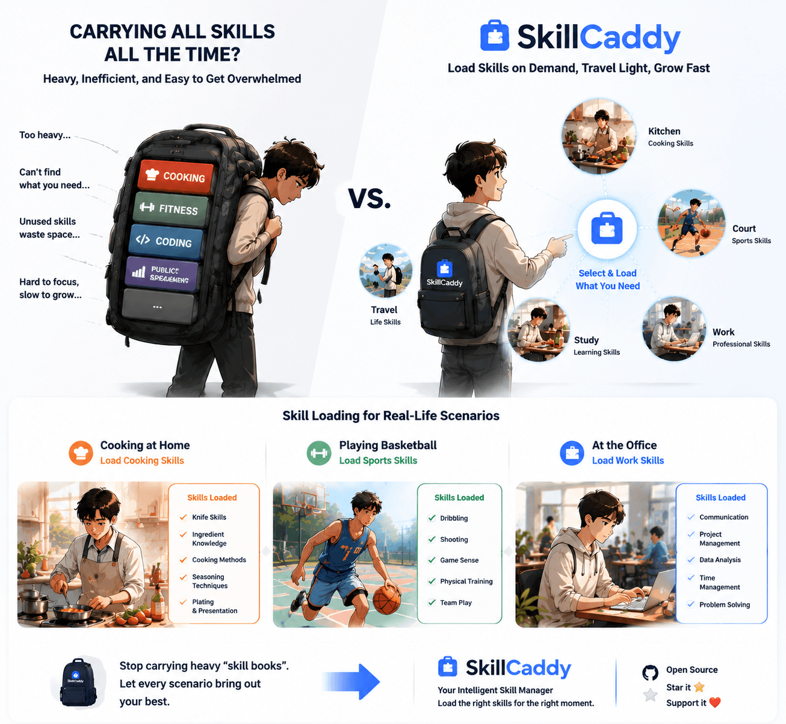

# Skillcaddy

[English](README.md) · [中文](README_CN.md)

Local AI skills central library + per-project symlink enablement. One AISkills directory holds every skill source; symlink what you need into any project on demand.



## Why Skillcaddy?

If you use Claude Code, Codex, OpenCode, or Pi across multiple projects, you eventually hit one of these:

- The same skill lives in three repos, slightly drifted each time
- A new project means copying skills over and wondering which version is current
- An upstream skill gets updated but your local copy is weeks behind
- A Claude-Code-only entry needs to coexist with the agents-side list
- An archived skill slips back in because no one gated it

Skillcaddy fixes this with one AISkills directory as the source of truth and per-project symlinks as the delivery mechanism.

- **One source of truth** — `~/AISkills/` aggregates `official / github / personal / archived / skills`
- **Zero project pollution** — enable by symlink into `.agents/skills/`; never copy
- **Multi-Agent by default** — one symlink reaches Claude Code, Codex, OpenCode, Pi via their standard paths
- **Independent enable / disable** — agents-side and Claude-Code-side are tracked separately
- **Safe by default** — disable only removes the symlink; `archived/` requires explicit naming
- **Contribute-friendly** — new skills land under `skills/<name>/` with `SKILL.md` + `agents/openai.yaml` and ship with the repo

Whether you're a solo dev with half a dozen repos, a small team standardizing on shared skills, or an author publishing reusable ones — the contract is the same: skills belong to your library, not to any one project.

## Installation

```bash
git clone https://github.com/chenweil/skillcaddy.git
cd skillcaddy
npm install
npm start
```

Requires Node.js >= 20. The web manager uses the fixed default URL `http://127.0.0.1:4173`. Fill in the target project path on the page, and enable/disable skills. If that port is temporarily occupied, start with `PORT=<other-port> npm start`.

### Global CLI / TUI command

Install the clone-backed command globally from this repository (uses local `npm link`; it does not download an npm package):

```bash
npm run install:cli
npm run check:cli
```

The installed `skillcaddy` command provides both the CLI and TUI. The older `install:tui` / `check:tui` names remain as compatibility aliases. You can also run `npm run tui -- install cli` from the clone, or choose `11. 安装/检查全局 CLI + TUI 命令` inside the TUI.

After linking the local CLI/TUI command once, the same entry point can manage the Web server and inspect or update skills from any project:

```bash
skillcaddy start [projectPath]     # start the Web manager
skillcaddy stop                    # stop Skillcaddy-owned Web only
skillcaddy restart [projectPath]   # restart the Web manager
skillcaddy -v                      # show the version
skillcaddy -h                      # show help
skillcaddy -u [projectPath]        # safely update registered Git skill sources
skillcaddy -a [projectPath]        # report project state, advice, and recommendations
```

`-a` is read-only and never creates source folders, installs, enables, or writes metadata. `-u` reuses the existing fast-forward-only Git source update flow and requires the current project path when invoked through the source-management API. `start` reuses a Web process that is already running; `stop` and `restart` act only on a process whose Skillcaddy ownership can be verified, so an external service on the port is not killed. `--root` selects the central library for source and analysis operations; Web lifecycle commands use the clone that provides the executable. Running `skillcaddy` without arguments still opens the TUI.

On platforms without a process-ownership probe, Web stop/restart fail closed rather than guessing which process to terminate.

If you do not want to link the global command yet, the repository-local entry supports the same commands:

```bash
npm run tui -- start --no-open
npm run tui -- stop
npm run tui -- -a /path/to/project
```

### Terminal UI (TUI)

For the interactive terminal manager, run:

```bash
npm run tui -- /path/to/project
# or with explicit root
npm run tui -- --root ~/AISkills /path/to/project
```

To use the cloned library from any project, link its CLI/TUI command once:

```bash
npm run install:cli
npm run check:cli

cd /path/to/another-project
skillcaddy
```

`install:cli` uses local `npm link`: it does not download or copy Skillcaddy from the npm registry. The global `skillcaddy` command remains linked to this clone, which stays the central library and can be updated with `git pull`. Running `skillcaddy` without an argument manages the current directory; `skillcaddy /path/to/project` selects another project. The installer refuses to replace a global `skillcaddy` package linked to another clone.

The TUI provides a full keyboard-driven interface without needing a browser:

- **View enabled skills** — Agents and Claude Code columns side by side
- **Browse/search skill library** — Keyword search, source filter, library drill-down
- **Enable skill** — Creates symlink in `.agents/skills/` and auto-syncs Claude Code
- **Clear enabled skill** — Removes project symlink only; source stays safe
- **Sync Claude Code** — One-click sync `.claude/skills/` with `.agents/skills/`
- **Edit metadata** — Inline note, tags, auto-enable toggle per skill
- **View diagnostics** — Advice on duplicates, broken links, source drift
- **Track collection setup** — Distinguish enabled links from project-ready configuration and guide interactive setup
- **Resolve duplicate names** — Enable a selected source skill under a suggested or custom project alias without renaming the source
- **Refresh project** — Reload state, switch project path
- **Update GitHub sources** — Batch fast-forward pull `github/` repos
- **Batch Chinese notes** — Interactive flow (option 10) to fill missing Chinese `note` fields for skills that only have an English description
- **Install/check the global command** — Option 11 installs the CLI + TUI command from this clone

Library browsing now shows skills in a compact paginated table (`n`/`p` to page through, `a` to bulk-enable). The skill introduction prefers the metadata `note` over the raw English `description` when both exist.

Menu navigation uses number keys (1-11) for actions, `/keyword` for search, `b` to go back, `q` to quit. Ideal for quick terminal workflows or headless environments.

To make the bundled `skillcaddy-manager` skill available to AI agents from any project, install its global entry once:

```bash
npm run install:manager
npm run check:manager
```

This creates a managed symlink at `~/.agents/skills/skillcaddy-manager` pointing back to `skills/skillcaddy-manager`. It will not overwrite an existing file, directory, or symlink that points somewhere else.

You can also pass the project path through the URL:

```text
http://127.0.0.1:4173/?projectPath=<encoded-project-path>
```

The page loads that project immediately, keeps recently used project paths in browser-local history, and lets you bulk-enable all available skills from a library with the library-level `+` button. If a library was enabled by mistake, use the library-level `×` button to clean that library from both Agents and Claude Code.

## Skill metadata

`SKILL.md` remains the Agent-facing contract. Human-facing notes and categorization are stored by Skillcaddy under `.skillcaddy/metadata/.../skillcaddy.json` so external source repositories stay clean:

```json
{
  "note": "Useful before and after code changes to keep execution disciplined.",
  "tags": ["Developer Tools", "Quality", "Workflow"],
  "autoEnable": true
}
```

Runtime scans and the web UI read metadata only from the local sidecar store. Tags appear as filter tabs and badge pills; notes are shown on each skill card. Set `autoEnable` to `false` to exclude a deprecated or risky skill from library-level bulk enable while still allowing single-skill manual enable. This keeps upstream source repositories clean while still making a large local skill library easier to browse.

Since v0.15.0, normal runtime scans ignore legacy `<skill-dir>/skillcaddy.json` files. The migration command explicitly discovers them, remains available through v0.15.x, and is removed in v0.16.0. Preview and apply the migration with:

```bash
npm run migrate:metadata
npm run migrate:metadata -- --yes
```

The apply command writes equivalent sidecar metadata and retains the legacy file for rollback. Runtime behavior changes only after the sidecar is written.

## Collection setup lifecycle

Some collections require a one-time, per-project setup after their skills are enabled. Skillcaddy keeps these contracts outside third-party clones under `collection-metadata/<source>/<collection>.json`. `/api/state` reports each configured collection as `missing`, `partial`, `ready`, or `invalid`.

Library-level enablement uses `POST /api/enable-plan` to include the declared setup skill when needed and `POST /api/enable-collection` to apply the shared plan. One lifecycle now classifies every candidate as enabled, unchanged, skipped, or failed and refreshes setup guidance for both Web and TUI. Enabling links remains allowed, but an incomplete collection is shown as pending rather than ready. Interactive setup is never run silently, and collection metadata cannot provide executable shell commands.

## Platform compatibility

| Platform | Status | Notes |
|----------|--------|-------|
| macOS | ✅ Fully supported | Native directory symlinks |
| Linux | ✅ Fully supported | Native directory symlinks |
| Windows | ⚠️ Extra setup required | See below |

### Windows prerequisites

Skillcaddy creates directory symlinks via Node's `fs.symlink(..., 'dir')`. On Windows this call requires one of the following or it throws `EPERM`:

1. **Enable Developer Mode (recommended)**
   - Settings → Privacy & Security → For developers → **Developer Mode**
   - Applies to Windows 10 Creators Update (1703) and above
2. **Run as Administrator**
   - Run `npm start` in an elevated terminal

### Known Windows limitations

- `readlink` may return the target with a `\\?\` prefix or backslashes, which can affect the duplicate-alias-target detection (`existingTarget !== resolvedSkillPath` check in `enableSkill`).
- NTFS is case-insensitive by default, but the code compares aliases case-sensitively. Usually fine in practice, but aliases that differ only in case are treated as two different skills.
- No Windows-specific path normalization, junction fallback, or copy-downgrade.

### Planned compatibility improvements (not implemented)

To make Skillcaddy work out of the box on Windows, the following strategies will be introduced later — but **none are implemented in the current version**:

- **Platform branch**: when `process.platform === 'win32'` is detected, prefer junction (`fs.symlink(target, path, 'junction')`); junctions don't require Developer Mode.
- **Failure fallback**: catch `EPERM` and recursively copy skill contents into `.agents/skills/`, and modify `disableSkill` to remove the real directory.
- **Path normalization**: `resolveLinkTarget` strips the `\\?\` prefix, normalizes separators, and compares case-insensitively on Windows.
- **README Windows section**: add PowerShell commands, disk-format requirements (NTFS), and a junction-vs-symlink trade-off note.

## Architecture

```
┌─────────────────────────────────────────────────────────────────┐
│                     Skillcaddy (central library)                 │
│  ~/AISkills/                                                    │
│  ├── official/      ─┬─ my-skill/SKILL.md                       │
│  ├── github/        ─┤                                          │
│  ├── personal/      ─┴─ another-skill/SKILL.md                  │
│  ├── archived/                                                   │
│  └── skills/         ← bundled with the repo (source: local)    │
└─────────────────────────────────────────────────────────────────┘
                              │
              Symlinks created on enable
                              ▼
┌─────────────────────────────────────────────────────────────────┐
│                         Project directory                        │
│  ~/projects/my-app/                                             │
│  ├── .agents/skills/                                            │
│  │   ├── my-skill ──────────────► ~/AISkills/official/my-skill  │
│  │   └── another-skill ─────────► ~/AISkills/personal/...       │
│  └── .claude/skills/                                            │
│  │   ├── my-skill ──► ../../.agents/skills/my-skill             │
│  │   └── another-skill ─► ../../.agents/skills/another-skill    │
│  └── .opencode/skills/  (optional)                              │
└─────────────────────────────────────────────────────────────────┘
                              │
      Each Agent auto-discovers and loads skills directories
                              ▼
┌─────────────────────────────────────────────────────────────────┐
│  Agent          │ Project-level skills path   │ User-level path │
│─────────────────────────────────────────────────────────────────│
│  Claude Code    │ .claude/skills/             │ ~/.claude/skills │
│  OpenCode       │ .opencode/skills/           │ ~/.config/...    │
│                 │ .claude/skills/             │ ~/.claude/skills │
│                 │ .agents/skills/             │ ~/.agents/skills │
│  Codex          │ .agents/skills/             │ ~/.agents/skills │
│  Pi             │ .pi/skills/                 │ ~/.pi/agent/...  │
│                 │ .agents/skills/             │ ~/.agents/skills │
└─────────────────────────────────────────────────────────────────┘
```

**Core design**:
- `.agents/skills` is the cross-Agent standard path; every Agent recognizes it.
- `.claude/skills` is Claude-Code-specific, but uses secondary symlinks pointing back into `.agents/skills`.
- Enable once, share across multiple Agents; disable only removes the symlink, source files stay safe.

## Directory layout

```text
skillcaddy/
├── official/      # Official / upstream skills (gitignored, fill locally)
├── github/        # Skills cloned from GitHub (gitignored)
├── personal/      # Personal original skills (gitignored)
├── archived/      # Retired skills (gitignored)
├── skills/        # Repo-bundled skills (shipped with this project; currently hosts skillcaddy-manager)
├── lib/           # Manager code
├── public/        # Web UI
├── scripts/       # Maintenance scripts (e.g. pull-github.sh)
├── server.js
└── test/
```

The four external skill source directories (`official / github / personal / archived`) are added to `.gitignore`. Use the managed source commands below instead of choosing a destination manually. `skills/` is the repo-bundled source, shipped with this project, and is **not** in `.gitignore`.

## Managed source acquisition

The first release is exposed through repository-local npm commands:

```bash
# Read-only inventory and inspection
npm run source -- list
npm run source -- inspect github/example/toolbox

# Preview, then acquire a Git repo, public HTTP(S) ZIP, direct SKILL.md,
# local ZIP, or local directory
npm run source -- add <input>
npm run source -- add <input> --yes

# Direct SKILL.md requires an explicit name and installs under official/<name>/
npm run source -- add https://example.com/SKILL.md --name example --yes

# Replace one registered source; Archive/Local updates require a new input,
# while Git/Remote file updates may reuse their registered origin
npm run source -- update <source-id> [input]
npm run source -- update <source-id> [input] --allow-breaking --yes [--project /path/to/project]

# Update all registered Git sources through the same safety path
npm run source -- update-git [--project /path/to/project]
```

`add` and `update` are separate operations. An identical repeated add is a successful no-op, while an identity or destination collision stops without authorizing replacement. Use `--name` or `--namespace` to resolve Archive/Local naming collisions. Remote files require `--name` and reject `--namespace`; use `update` only for a source identity already present in the source registry. A Remote-file update may omit input to reuse the registered origin or supply a new stable URL to migrate that origin.

CLI exit categories are stable: `0` success or identical no-op, `1` general acquisition/update failure, `2` invalid usage, `3` unresolved identity or collision, and `4` missing authorization for a breaking replacement.

Acquisition changes only the central library. It never creates project links, executes acquired code, runs setup, or invokes runtime preflight. Enablement uses an already acquired skill through the existing Web, TUI, or project-link API. For an explicit combined request, acquire first, rescan state, resolve the one requested skill by full ID, and enable only that selection.

Unknown setup readiness produces no generic warning or gate. A declared setup contract may add a non-blocking reminder after enablement. The publisher skill's runtime preflight remains responsible for proprietary credentials and setup, such as an IMA API key.

### Adopt an existing library

Migration preserves physical source paths and project links. Preview it first:

```bash
npm run source -- migrate
npm run source -- migrate --yes
```

The apply command writes only sidecar records under `.skillcaddy/sources/`; ambiguous sources remain unresolved rather than guessed. For extra recovery protection, copy that registry directory before applying. Restoring that copy restores the previous registry state without moving central-library content. Failed add and update operations clean up or roll back automatically; after any interruption, run `npm run source -- list` and `npm run source -- inspect <source-id>` before retrying.

The first release supports complete Git repositories, public HTTP(S) ZIP files, stable direct HTTP(S) `/SKILL.md` files, local ZIP files, and local directories. It does not provide source acquisition or replacement in Web/TUI, source removal, automatic latest-version selection, or non-ZIP archives. The clone-backed global `skillcaddy` command now also exposes Web lifecycle, read-only analysis, and registered-Git update entry points while retaining the existing source-management boundaries; it does not turn source acquisition into a global npm package. A Remote file acquires only one `SKILL.md`; skills with companion files must use a ZIP, Local, or complete Git source.

Bundled with this repo (only when contributing to Skillcaddy itself):

```text
skills/<skill-name>/
├── SKILL.md
└── agents/
    └── openai.yaml   # Codex / OpenCode metadata (optional)
```

Skills under `skills/` are tagged during scan as `source: 'local'`, `id: 'local/<name>'` — behavior is identical to other sources and they can be enabled into any project's `.agents/skills/`.

On startup the manager scans every source directory (`official / github / personal / archived / skills`); no service restart is needed to see new skills in the UI.

## Updating Git sources

Update every registered Git source through the unified fast-forward-only safety path. Dirty working trees are skipped, and breaking updates that affect a known current-project link are blocked:

```bash
npm run source -- update-git --project /path/to/project
```

When the command is run from the central library clone, pass `--project` (or set
`SKILLCADDY_PROJECT`) so breaking updates are checked against the intended
project's `.agents/skills/` links.

If a registered Git checkout was advanced manually with `git pull`, repair only
the sidecar registry with an explicit adoption plan:

```bash
npm run source -- repair github/<owner>/<repo> --project /path/to/project
npm run source -- repair github/<owner>/<repo> --project /path/to/project --yes
```

Repair does not pull, overwrite, stash, or reset the checkout. It only adopts a
clean checkout that is on the registered ref, matches its configured remote,
has advanced by fast-forward, and passes source validation. Breaking project
links still require `--allow-breaking`; dirty checkouts are left untouched and
reported as reminders.

## Skills bundled with this project

### skillcaddy-manager

Lets an Agent (especially Codex) know how to use Skillcaddy itself correctly:

- List currently available skills (source / collection / alias / path)
- Enable / disable a single skill, or batch-operate on a whole source / collection
- Sync Claude Code entry points
- Update GitHub-source local clones
- Health check (broken links, alias conflicts, archived mis-enabled)
- Detect conflicts and require user confirmation

**Safety rules**: only operate on project-side `.agents/skills` symlinks; never delete central source files; never touch `archived/` unless explicitly named; always produce a dry-run summary before any state change.

**Invocation**: `agents/openai.yaml` sets `allow_implicit_invocation: true`, so the Agent auto-loads it when seeing a relevant request.

## Enable / Disable

**Enable**: creates a symlink under the project's `.agents/skills/` pointing back into the central library.

```text
<project>/.agents/skills/<alias> -> <skillcaddy>/<source>/<skill>
```

**Sync Claude**: creates a `.claude/skills/` entry point for Claude Code, where each skill symlinks into `.agents/skills/`.

```text
<project>/.claude/skills/<alias> -> ../../.agents/skills/<alias>
```

**Disable**: removes the symlink. The source file is left untouched.

**Why two layers of symlinks?**
- `.agents/skills` is the Agent Skills standard; Codex / OpenCode / Pi all recognize it.
- `.claude/skills` lets Claude Code use them too, with independent enable/disable.
- Enable once, share across Agents; disable doesn't touch the source files — safe and reversible.

## Recommendation System

Skillcaddy includes a built-in recommendation system to help users discover and choose appropriate skills.

### Quick View

```bash
node skills/skillcaddy-manager/scripts/view-recommendations.cjs onboarding
node skills/skillcaddy-manager/scripts/view-recommendations.cjs scenario new-project
```

### Recommendation Principles

- **Analyze first**: Inspect the current library and project context before recommending
- **Platform first**: Empty libraries should start with discovery platforms, not a fixed starter library
- **Scenario split**: mattpocock + lencx is for clear development workflows, not the blank default
- **Overlap review**: Compare collection names, capability lists, and descriptions before enabling similar libraries
- **Global detection**: Detect global skills directories and suggest unified management

### Empty-Library Default

When the library is empty, the default recommendation is:

1. Discovery platforms: `skillsmp`, `skills.sh`
2. Then classify the use case: development, writing, research, design
3. Only after that, choose a starter library

### Development Starter

**Development workflow golden combo:**

1. **mattpocock/skills** (workflow suite)
   - Setup: guided `setup-matt-pocock-skills` project configuration with readiness tracking
   - Includes: TDD, domain modeling, debugging, implementation, grilling

2. **lencx/skills** (project control)
   - coding-protocol: Prevent AI from making unintended changes
   - keel: Architecture governance

### Utility Scripts

```bash
node skills/skillcaddy-manager/scripts/check-conflicts.cjs <collection-id> --against <installed-id,installed-id>
node skills/skillcaddy-manager/scripts/check-global-skills.cjs
node skills/skillcaddy-manager/scripts/version-manager.cjs check
```

See [the Skillcaddy manager recommendation branch](skills/skillcaddy-manager/references/RECOMMENDATION_GUIDE.md) for detailed documentation.


## Tests

```bash
npm test
```

## Link
[Linux Do](https://linux.do/)
[浅谈 AI 编程](https://mp.weixin.qq.com/s/f-NIkyxIuA8vjAUDp1bh5w)
[深度思考：架构腐朽 & Loop Engineering](https://mp.weixin.qq.com/s/wINKSDQCroWBvf29h567zA)
